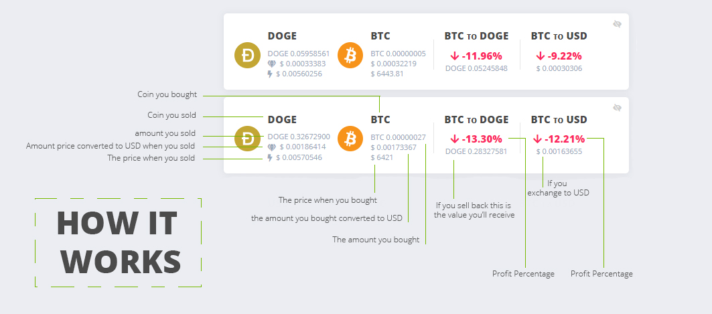

## Eobot Trader

This tools(chrome Extension) helps you to know more information about your coins and helps you to trade coins to another easly

## License

GPL-3.0

## How to install

if you have git installed you can do git clone and frequently git pull to receive updates

```
git clone git@github.com:rrfaria/eobot-trader.git
```

go to chrome://extensions/
enable developer mode
then click in load extended extension and select the extension folder where you have cloned

after that it will show new layout

## How Extension Works

It stores your information on localstorage if you clean browser cache you will lose the informations

first of all

to see the transations you need to do transitions using the yellow button "transation" on exchange page instead of use buy button
transation will store your information and then buy the coin clicking automaticaly on buy button to you

The Minimum button will set minimum amount to do a transation



## Send Suggestion Or fixes

send in suggestion/fixes to the project on issues

I'll be happy in receive your suggestion and comments about the project

## Support the project

If you wanna help this project you can donate some doges to development cost.
Doge wallet:

DK6d8maJtwQSBpMVjicre6e9CJ1hk7gntM

# 💪 TODO

Plans to New features:

To APP:

- Add Price to Sell Coin
- Auto trade
- Settings Panel
- Multi Language
- Difficulty Charts to help you to know coin is faster to mine.

To Code:

- Add code lint
- Add unit tests
- Add BBD
- convert to some framework ( vue.js/ React.js)

# 🤘 ChangeLog 🤘

#### 1.1 🏆🙌 - FEATURE

- Added Sell price indicator

#### 1.0.1 🐞 - FIX

- Added Change log
- Div state(trading history and realtime) - Div stays open even if reload page

### 1.0 🚀 - Launch

- Trading history
- Realtime charts
